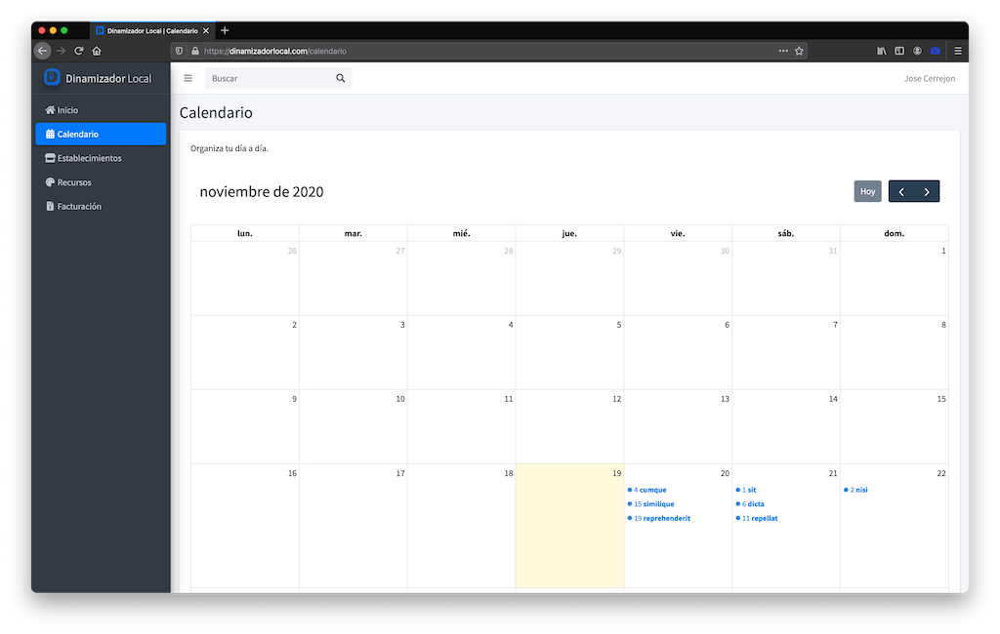

# Local Dynamizer Admin Panel


This panel (only in Spanish atm) tries to help community managers to manage their clients' social networks. For now it is a proof of concept with sections to import resources that can serve them, an agenda to keep appointments and a database with clients (here called stores).

-   Site under development at: https://dinamizadorlocal.com (Ask me for a user if you want to test it).

-   ⏰ Estimated hours of work so far: 102 hours.

-   More screenshots on [screenshots directory](./screenshots).





### Prerequisites

-   Modify on _php.ini_ date.timezone = "Europe/Madrid"

### Install

```sh
git clone https://github.com/jmcerrejon/localdynamizer.git
composer update && npm install
cp .env.example .env # Add your MySQL config
php artisan key:generate
php artisan migrate --seed
php artisan storage:link # If you have a /public_html dir, skip this command and check the next section
composer dump-autoload
```

#### Storage link in /public_html

Maybe our hosting has a _public_html_ directory, so we can't use public. Don't worry, try the next:

```sh
ln -s $PWD/storage/app/public/ $PWD/public_html/storage
sudo chmod -R 775 storage
```

#### 403 issues

It's a knighmare. Some tips:

```sh
chown -R $USER:$(id -gn $USER) storage
chown -h $USER:$(id -gn $USER) storage
find * -type d -exec chmod 755 {} \;
find * -type f -exec chmod 644 {} \;
```

On **production** environment an extra step maybe is required:

Install packages:

```sh
sudo apt install -y php7.3-zip php-xml php7.3-gd
```

Change time-zone (Debian):

```sh
timedatectl set-timezone "Europe/Madrid"
timedatectl | grep "Time"
timedatectl  status
```

Now:

```sh
npm run production
php artisan config:cache # Run this when update files inside /config
```

### Packages and Libraries

-   https://flickity.metafizzy.co/

-   https://github.com/michalsnik/aos/tree/v2

-   https://github.com/spatie/laravel-searchable

-   https://github.com/fiduswriter/Simple-DataTables

-   https://docs.laravel-excel.com/3.1/getting-started/

### Credits

👨🏻‍💻 Jose Manuel Cerrejon Gonzalez

✉️ jmcerrejon@icloud.com

📍 Huelva, Spain

Dev with ♥️ using [Laravel](https://www.laravel.com), AdminLTE for panel and landing/Admin panel with [Tailwind CSS](https://tailwindcss.com).

📚 Creative Commons Attribution-NonCommercial-NoDerivatives 4.0 International Public License ©2020
