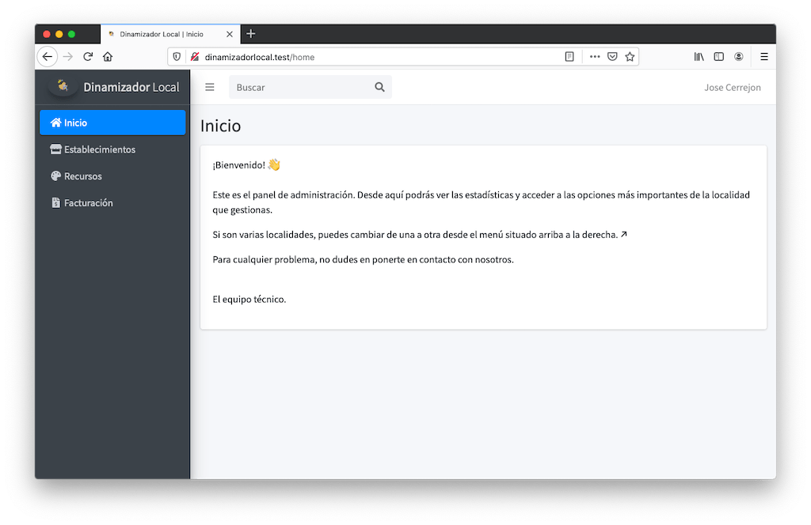

# Local Dynamizer Admin Panel

* Site under development at: http://dinamizadorlocal.com




👨🏻‍💻 Jose Manuel Cerrejon Gonzalez

✉️ jmcerrejon@icloud.com

📍 Huelva, Spain

📚 Creative Commons Attribution-NonCommercial-NoDerivatives 4.0 International Public License ©2020

Dev with ♥️ using [Laravel](https://www.laravel.com)

### Prerequisites

* Modify on *php.ini* date.timezone = "Europe/Madrid"

### Install

```
git clone https://github.com/jmcerrejon/localdynamizer.git
composer update && npm install
cp .env.example .env
php artisan migrate:fresh
php artisan storage:link
composer dump-autoload
chown -R www-data:www-data storage
```

On **production** environment an extra step is required:

Install packages:

```
sudo apt install -y php7.3-zip php-xml php7.3-gd
```

Change time-zone (Debian):

```
timedatectl set-timezone "Europe/Madrid"
timedatectl | grep "Time"
timedatectl  status
```

Now: 

```
npm run production
php artisan config:cache # Run this when update files inside /config 
```

### Development

**NOTE:** Due we need to get this project raise up in a snap, TDD will be added in a near future. [Pest](https://pestphp.com/) is already included and ready to use 😉.
